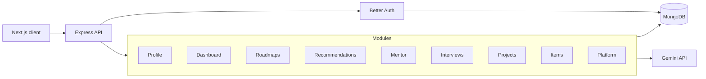

# SkillForge AI — API Server

Production-oriented Express and TypeScript API for SkillForge AI, an agentic career roadmap and learning mentor platform. The server owns authentication, learner personalization, roadmap and progress persistence, recommendation context, AI conversations, interview practice, project state, public item CRUD, and platform activity data.

> Frontend repository: [SCIC-Assignment-05-Client](https://github.com/FBushra-git/SCIC-Assignment-05-Client)

## Core capabilities

- Better Auth email/password sessions with optional Google OAuth
- MongoDB-backed learner profiles, skills, roadmaps, projects, conversations, interview sessions, and activity
- Gemini roadmap generation using structured prompts and JSON validation
- Context-aware AI mentor grounded in profile, current roadmap, completed topics, and previous messages
- Dynamic recommendation generation from goals, skills, weak areas, progress, and project state
- Interview question generation with bookmarks, completion, and session history
- Public roadmap and learning-resource catalogs with search, multi-filtering, sorting, and pagination
- Ownership-protected item CRUD with public listing and details endpoints
- Real platform statistics, newsletter subscriptions, contact requests, and account-recovery tickets
- Zod request validation, centralized error handling, secure headers, CORS, compression, cookies, logging, and rate limiting

## Technology

| Area | Technology |
| --- | --- |
| Runtime | Node.js 20+ |
| API | Express 5 |
| Language | TypeScript |
| Database | MongoDB native driver and Better Auth MongoDB adapter |
| Authentication | Better Auth and JWT support |
| AI | Google Gemini API |
| Validation | Zod |
| Security | Helmet, CORS, express-rate-limit, cookie-parser |
| Logging | Pino and pino-http |
| Development | Nodemon and tsx |
| Testing | Node test runner through tsx |

## Architecture



Each domain module owns its routes, controller, input schema, and service logic. Routes stay thin, controllers translate HTTP input/output, and services contain database and AI orchestration.

## API overview

All application endpoints are mounted below `/api/v1`. Better Auth uses `/api/auth`.

| Prefix | Access | Responsibility |
| --- | --- | --- |
| `/api/v1/health` | Public | Service and database health checks |
| `/api/v1/public-roadmaps` | Public | Roadmap discovery, filtering, pagination, and details |
| `/api/v1/resources` | Public | Curated learning resource discovery |
| `/api/v1/platform` | Public | Live statistics, newsletter, contact, and recovery requests |
| `/api/v1/items/public` | Public | Learner-owned project item listing and details |
| `/api/v1/profiles` | Authenticated | Learner profile, career goal, preferences, and skills |
| `/api/v1/dashboard` | Authenticated | Personalized dashboard summary and analytics |
| `/api/v1/roadmaps` | Authenticated | AI generation, saved roadmaps, details, and progress |
| `/api/v1/recommendations` | Authenticated | Personalized next-action recommendations |
| `/api/v1/mentor` | Authenticated | Context-aware messages and conversation history |
| `/api/v1/interviews` | Authenticated | AI question sessions, bookmarks, and completion |
| `/api/v1/projects` | Authenticated | Project catalog and learner project status |
| `/api/v1/items` | Authenticated | Create, list owned, update, and delete project items |
| `/api/auth/*` | Mixed | Better Auth registration, login, session, OAuth, and account operations |

Protected endpoints derive ownership from the authenticated session rather than accepting a client-supplied user identifier.

## Getting started

### Prerequisites

- Node.js 20 or newer
- npm
- MongoDB locally or a MongoDB Atlas connection string
- A Gemini API key for AI functionality
- Google OAuth credentials only when Google login is required

### Installation

```bash
git clone https://github.com/FBushra-git/SCIC-Assignment-05-Server.git
cd SCIC-Assignment-05-Server
npm install
```

Create the environment file:

```bash
cp .env.example .env
```

On PowerShell:

```powershell
Copy-Item .env.example .env
```

Start development:

```bash
npm run dev
```

The API runs at [http://localhost:5000](http://localhost:5000) by default.

## Environment variables

Never commit `.env` or expose secret values in client-side code.

| Variable | Required | Description |
| --- | --- | --- |
| `NODE_ENV` | No | `development`, `test`, or `production` |
| `PORT` | No | HTTP port; defaults to `5000` |
| `CLIENT_URL` | Yes | Trusted frontend origin; comma-separate multiple origins |
| `MONGODB_URI` | Yes | MongoDB connection string including the target database |
| `BETTER_AUTH_URL` | Yes | Public server origin used by Better Auth |
| `BETTER_AUTH_SECRET` | Yes | Random secret with at least 32 characters |
| `JWT_SECRET` | Yes | Independent random JWT secret with at least 32 characters |
| `GOOGLE_CLIENT_ID` | No | Google OAuth client ID |
| `GOOGLE_CLIENT_SECRET` | No | Google OAuth client secret |
| `GEMINI_API_KEY` | For AI | Google AI Studio API key |
| `GEMINI_MODEL` | No | Primary model; template default is `gemini-3.5-flash` |
| `GEMINI_FALLBACK_MODEL` | No | Fallback model; template default is `gemini-3.1-flash-lite` |

Generate strong local secrets with Node.js:

```bash
node -e "console.log(require('crypto').randomBytes(48).toString('hex'))"
```

Use a different generated value for `BETTER_AUTH_SECRET` and `JWT_SECRET`.

## Google OAuth setup

1. Create a Web application OAuth client in Google Cloud Console.
2. Add the local authorized JavaScript origin: `http://localhost:3000`.
3. Add the local authorized redirect URI: `http://localhost:5000/api/auth/callback/google`.
4. Set `GOOGLE_CLIENT_ID` and `GOOGLE_CLIENT_SECRET` in `.env`.
5. For production, add the deployed client origin and deployed server callback URI.

Google login remains disabled when either Google environment variable is absent; email/password authentication continues to work.

## Gemini setup

1. Create an API key in Google AI Studio.
2. Set `GEMINI_API_KEY` in `.env`.
3. Optionally override the primary and fallback models.
4. Restart the server after changing environment variables.

Roadmap, recommendation, mentor, and interview modules validate AI output before storing or returning it. If the primary model is unavailable, the service attempts the configured fallback model.

## Available commands

| Command | Description |
| --- | --- |
| `npm run dev` | Start Express through Nodemon and tsx |
| `npm run build` | Compile TypeScript into `dist` |
| `npm start` | Run the compiled production server |
| `npm run typecheck` | Type-check without emitting files |
| `npm run lint` | Run ESLint across the server |
| `npm test` | Run schema validation tests |

## Project structure

```text
src/
├── app.ts                    # Express application and middleware
├── index.ts                  # Server startup and graceful shutdown
├── config/
│   ├── auth.ts               # Better Auth and Google provider setup
│   ├── database.ts           # MongoDB connection and indexes
│   └── env.ts                # Validated environment configuration
├── middlewares/              # Authentication and error handling
├── modules/
│   ├── ai/                   # Gemini request and fallback service
│   ├── dashboard/            # Aggregated learner workspace data
│   ├── interview/            # AI interview practice
│   ├── item/                 # Complete owned item CRUD
│   ├── mentor/               # Context-aware AI conversations
│   ├── platform/             # Statistics and public forms
│   ├── profile/              # Personalization foundation
│   ├── project/              # Project catalog and learner state
│   ├── public-roadmap/       # Public discovery catalog
│   ├── recommendation/       # Personalized next actions
│   ├── resource/             # Learning resource catalog
│   └── roadmap/              # Generation, storage, and progress
├── routes/                   # API composition and health routes
└── utils/                    # Shared errors and helpers
```

## Security model

- Environment variables are validated during startup.
- Better Auth manages session cookies and password hashing.
- Strong password rules are enforced on registration and password changes.
- Trusted origins are derived from `CLIENT_URL`.
- Helmet applies secure HTTP headers.
- API and authentication routes use rate limits.
- Zod validates external input before database or AI operations.
- Item update/delete operations verify ownership server-side.
- Account deletion removes the associated personalization profile.
- Secrets and raw database credentials are never returned by API responses.

## Validation

Run the complete local quality gate before publishing:

```bash
npm run lint
npm run typecheck
npm test
npm run build
```

The test suite covers valid and invalid item CRUD payloads, newsletter email normalization, contact requests, and account-recovery validation.

## Deployment

The server can run on Render, Railway, or another Node.js host.

1. Provision a MongoDB Atlas database and restrict network/user access appropriately.
2. Add every required environment variable in the hosting dashboard.
3. Set `BETTER_AUTH_URL` to the public HTTPS server origin.
4. Set `CLIENT_URL` to the deployed frontend origin.
5. Build with `npm run build` and start with `npm start`.
6. Update Google OAuth origins and callback URLs after both deployments are stable.
7. Confirm `/api/v1/health` before testing authentication and AI features.

## License

Built for SCIC Assignment 05. Review the repository license and assignment terms before reuse.
